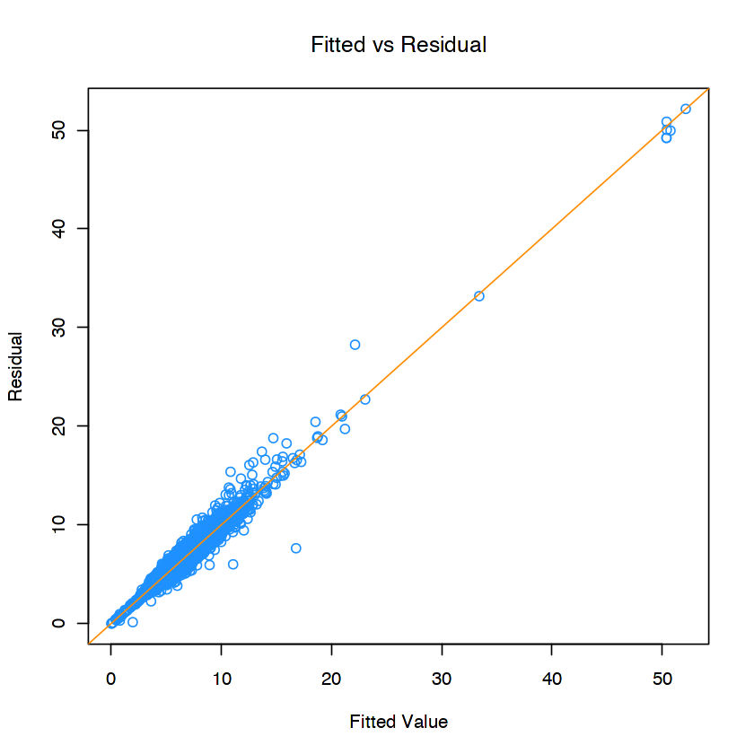
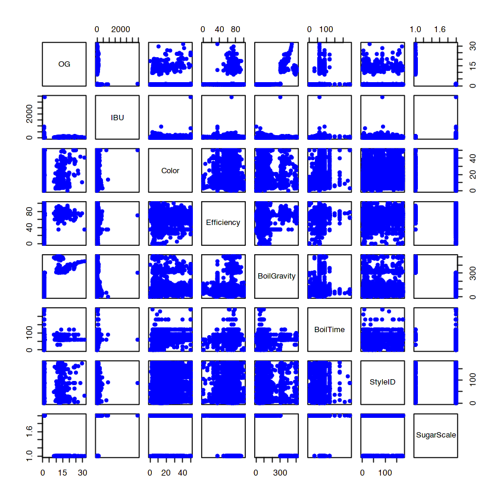
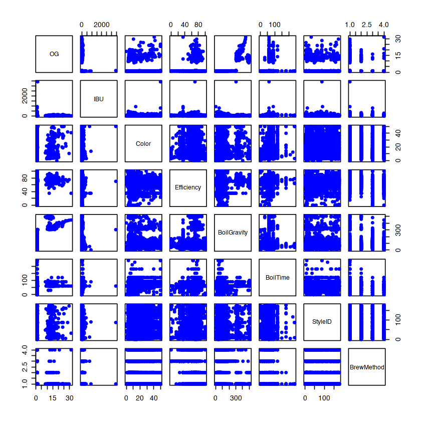
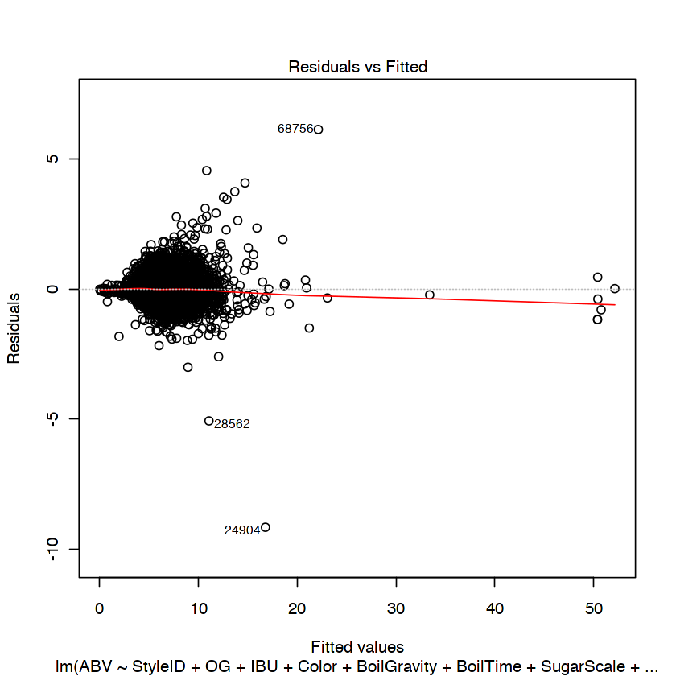
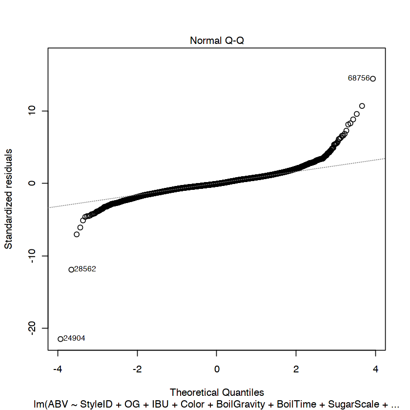
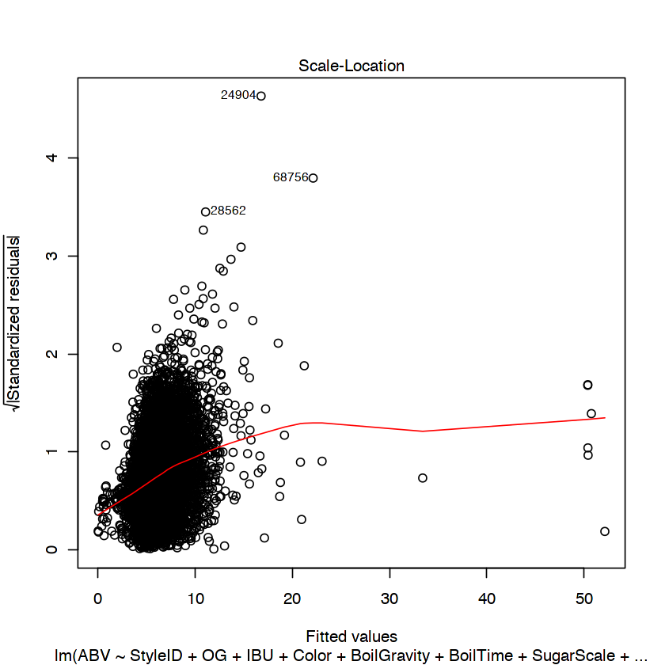
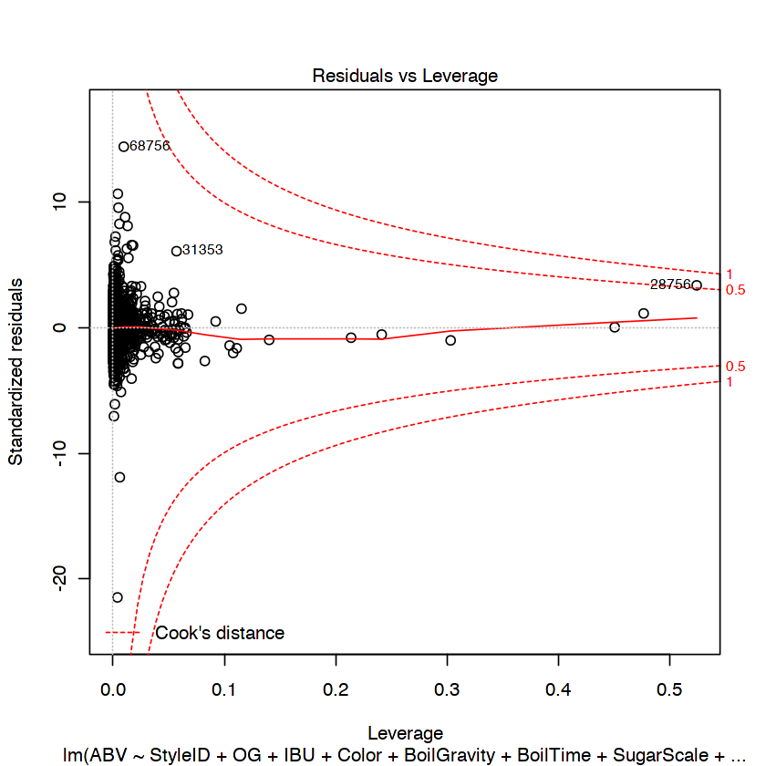

```R
library("dplyr")
beer = read.csv('recipeData3.csv')
beer$Style = as.factor(beer$Style)
dim(beer)

names(beer)
coln = c('Style', 'StyleID','OG', 'FG', 'ABV', 'IBU', 'Color', 
                 'Efficiency', 'BoilGravity', 'BoilTime', 'SugarScale', 'BrewMethod')

coln_sub = c('OG', 'FG', 'ABV', 'IBU', 'Color', 
                 'Efficiency', 'BoilGravity', 'BoilTime', 'SugarScale', 'BrewMethod')

#dataset = subset( beer[, coln], Style == "American IPA" 
#                 & !BoilGravity %in% c("NA","N/A", 1.033, 1.08)
#                 & !Color %in% c("NA","N/A"))

dataset = subset( beer[, coln], 
                   !BoilGravity %in% c("NA","N/A", 1.033, 1.08)
                 & !Color %in% c("NA","N/A"))

dataset[, c("BoilGravity")] = as.numeric(dataset[, c("BoilGravity")])

#dataset = subset( beer[, coln],
#                  !BoilGravity %in% c("NA","N/A")
#                 & !Color %in% c("NA","N/A"))

head(dataset)

set.seed(142)
n = nrow(dataset)
ind = sample(1:nrow(dataset), n * 1/2, replace = FALSE, prob = NULL)
#dsubset = dataset[ind, coln_sub] 

dsubset = dataset[ind, coln] 

n = nrow(dsubset)
ind = sample(1:nrow(dsubset), n * 1/3, replace = FALSE, prob = NULL)

#dsubset[, c("StyleID")] = as.factor(dsubset[, c("StyleID")])
train_set = dsubset[ind,]
test_set = dsubset[-ind,]


dim(train_set)
dim(test_set)

str(train_set)

#system.time( (
#fit = lm(ABV ~ (. - FG - Style) + 
#        (OG + IBU + Color + Efficiency + BoilGravity + BoilTime + StyleID )*SugarScale + 
#        (OG + IBU + Color + Efficiency + BoilGravity + BoilTime + StyleID)*BrewMethod,
#         data = train_set)
#)
#)

system.time( (
fit = lm(ABV ~ (. - FG - Style) + 
        (OG + IBU + Color + Efficiency + BoilGravity + BoilTime + StyleID ) * (SugarScale + BrewMethod),
         data = train_set)
)
)


system.time((
model = step( fit, direction = "backward", trace=0) 
))
summary(model)
```


<ol class=list-inline>
	<li>73861</li>
	<li>23</li>
</ol>


<ol class=list-inline>
	<li>'BeerID'</li>
	<li>'Name'</li>
	<li>'URL'</li>
	<li>'Style'</li>
	<li>'StyleID'</li>
	<li>'Size.L.'</li>
	<li>'OG'</li>
	<li>'FG'</li>
	<li>'ABV'</li>
	<li>'IBU'</li>
	<li>'Color'</li>
	<li>'BoilSize'</li>
	<li>'BoilTime'</li>
	<li>'BoilGravity'</li>
	<li>'Efficiency'</li>
	<li>'MashThickness'</li>
	<li>'SugarScale'</li>
	<li>'BrewMethod'</li>
	<li>'PitchRate'</li>
	<li>'PrimaryTemp'</li>
	<li>'PrimingMethod'</li>
	<li>'PrimingAmount'</li>
	<li>'UserId'</li>
</ol>


<table>
<thead><tr><th></th><th scope=col>Style</th><th scope=col>StyleID</th><th scope=col>OG</th><th scope=col>FG</th><th scope=col>ABV</th><th scope=col>IBU</th><th scope=col>Color</th><th scope=col>Efficiency</th><th scope=col>BoilGravity</th><th scope=col>BoilTime</th><th scope=col>SugarScale</th><th scope=col>BrewMethod</th></tr></thead>
<tbody>
	<tr><th scope=row>1</th><td>Cream Ale                         </td><td> 45                               </td><td>1.055                             </td><td>1.013                             </td><td>5.48                              </td><td>17.65                             </td><td> 4.83                             </td><td>70                                </td><td>40                                </td><td>75                                </td><td>Specific Gravity                  </td><td>All Grain                         </td></tr>
	<tr><th scope=row>2</th><td>Holiday/Winter Special Spiced Beer</td><td> 85                               </td><td>1.083                             </td><td>1.021                             </td><td>8.16                              </td><td>60.65                             </td><td>15.64                             </td><td>70                                </td><td>72                                </td><td>60                                </td><td>Specific Gravity                  </td><td>All Grain                         </td></tr>
	<tr><th scope=row>5</th><td>Belgian Blond Ale                 </td><td> 20                               </td><td>1.060                             </td><td>1.010                             </td><td>6.48                              </td><td>17.84                             </td><td> 4.57                             </td><td>72                                </td><td>52                                </td><td>90                                </td><td>Specific Gravity                  </td><td>All Grain                         </td></tr>
	<tr><th scope=row>6</th><td>American Pale Ale                 </td><td> 10                               </td><td>1.055                             </td><td>1.013                             </td><td>5.58                              </td><td>40.12                             </td><td> 8.00                             </td><td>79                                </td><td>49                                </td><td>70                                </td><td>Specific Gravity                  </td><td>All Grain                         </td></tr>
	<tr><th scope=row>8</th><td>Cream Ale                         </td><td> 45                               </td><td>1.054                             </td><td>1.014                             </td><td>5.36                              </td><td>19.97                             </td><td> 5.94                             </td><td>70                                </td><td>42                                </td><td>75                                </td><td>Specific Gravity                  </td><td>All Grain                         </td></tr>
	<tr><th scope=row>9</th><td>Robust Porter                     </td><td>129                               </td><td>1.060                             </td><td>1.016                             </td><td>5.77                              </td><td>31.63                             </td><td>34.76                             </td><td>73                                </td><td>44                                </td><td>75                                </td><td>Specific Gravity                  </td><td>All Grain                         </td></tr>
</tbody>
</table>


<ol class=list-inline>
	<li>11607</li>
	<li>12</li>
</ol>


<ol class=list-inline>
	<li>23214</li>
	<li>12</li>
</ol>


    'data.frame':	11607 obs. of  12 variables:
     $ Style      : Factor w/ 176 levels "Altbier","Alternative Grain Beer",..: 86 7 15 170 175 9 57 114 134 7 ...
     $ StyleID    : int  86 7 15 170 175 9 58 114 134 7 ...
     $ OG         : num  1.07 1.07 1.06 1.04 1.05 ...
     $ FG         : num  1.01 1.02 1.01 1.01 1.01 ...
     $ ABV        : num  7.87 6.89 6.07 4.08 5.17 6.52 4.86 5.09 6.11 4.87 ...
     $ IBU        : num  87.2 56 20.1 20.1 18.5 ...
     $ Color      : num  9.28 7.04 6.21 3.59 4.31 ...
     $ Efficiency : num  72.5 70 68 35 65 75 75 82 35 50 ...
     $ BoilGravity: num  59 97 48 41 29 50 57 42 54 103 ...
     $ BoilTime   : int  60 60 60 60 90 75 75 60 60 60 ...
     $ SugarScale : Factor w/ 2 levels "Plato","Specific Gravity": 2 2 2 2 2 2 2 2 2 2 ...
     $ BrewMethod : Factor w/ 4 levels "All Grain","BIAB",..: 2 4 1 3 2 1 1 2 1 3 ...


       user  system elapsed 
      0.015   0.001   0.016 


       user  system elapsed 
      0.859   0.084   0.945 


    
    Call:
    lm(formula = ABV ~ StyleID + OG + IBU + Color + BoilGravity + 
        BoilTime + SugarScale + BrewMethod + OG:SugarScale + OG:BrewMethod + 
        Color:SugarScale + BoilGravity:BrewMethod + BoilTime:BrewMethod, 
        data = train_set)
    
    Residuals:
        Min      1Q  Median      3Q     Max 
    -9.1510 -0.2229 -0.0333  0.2383  6.1242 
    
    Coefficients:
                                         Estimate Std. Error  t value Pr(>|t|)    
    (Intercept)                        -5.156e-01  1.513e-01   -3.408 0.000656 ***
    StyleID                            -2.465e-04  7.161e-05   -3.443 0.000578 ***
    OG                                  4.418e-01  7.796e-03   56.666  < 2e-16 ***
    IBU                                 5.096e-04  9.025e-05    5.647 1.67e-08 ***
    Color                              -7.937e-04  2.215e-03   -0.358 0.720050    
    BoilGravity                         6.689e-05  2.824e-04    0.237 0.812753    
    BoilTime                            9.588e-04  3.224e-04    2.974 0.002943 ** 
    SugarScaleSpecific Gravity         -1.010e+02  3.764e-01 -268.389  < 2e-16 ***
    BrewMethodBIAB                     -1.070e-02  5.292e-02   -0.202 0.839842    
    BrewMethodextract                   1.413e-01  6.438e-02    2.194 0.028223 *  
    BrewMethodPartial Mash              2.935e-01  1.102e-01    2.662 0.007770 ** 
    OG:SugarScaleSpecific Gravity       1.011e+02  2.866e-01  352.759  < 2e-16 ***
    OG:BrewMethodBIAB                  -4.092e-02  1.370e-02   -2.986 0.002828 ** 
    OG:BrewMethodextract                2.622e-03  2.162e-02    0.121 0.903460    
    OG:BrewMethodPartial Mash           6.729e-02  1.340e-02    5.020 5.25e-07 ***
    Color:SugarScaleSpecific Gravity   -8.059e-03  2.242e-03   -3.594 0.000327 ***
    BoilGravity:BrewMethodBIAB          1.266e-03  4.653e-04    2.722 0.006499 ** 
    BoilGravity:BrewMethodextract       4.177e-04  3.808e-04    1.097 0.272686    
    BoilGravity:BrewMethodPartial Mash -1.342e-03  5.601e-04   -2.395 0.016623 *  
    BoilTime:BrewMethodBIAB             7.491e-04  7.775e-04    0.963 0.335353    
    BoilTime:BrewMethodextract         -3.265e-03  9.575e-04   -3.410 0.000651 ***
    BoilTime:BrewMethodPartial Mash    -5.055e-03  1.658e-03   -3.049 0.002299 ** 
    ---
    Signif. codes:  0 ‘***’ 0.001 ‘**’ 0.01 ‘*’ 0.05 ‘.’ 0.1 ‘ ’ 1
    
    Residual standard error: 0.4267 on 11585 degrees of freedom
    Multiple R-squared:  0.9541,	Adjusted R-squared:  0.954 
    F-statistic: 1.147e+04 on 21 and 11585 DF,  p-value: < 2.2e-16


```R
the_model = lm(formula = ABV ~ StyleID + OG + IBU + Color + BoilGravity + 
    BoilTime + SugarScale + BrewMethod + OG:SugarScale + Color:SugarScale + 
    OG:BrewMethod + BoilGravity:BrewMethod + BoilTime:BrewMethod, 
    data = train_set)

plot(fitted(the_model), train_set$ABV, col="dodgerblue", xlab="Fitted Value", ylab="Residual",
    main="Fitted vs Residual")
m = mean(fitted(the_model))
s = sd(fitted(the_model))
abline(0,1, col="darkorange")

```





```R
plot(train_set[, c("OG","IBU","Color","Efficiency","BoilGravity","BoilTime","StyleID","SugarScale")],
               pch=16, col="blue") 

plot(train_set[, c("OG","IBU","Color","Efficiency","BoilGravity","BoilTime","StyleID","BrewMethod")],
               pch=16, col="blue") 
```








```R
plot(the_model) 
```













